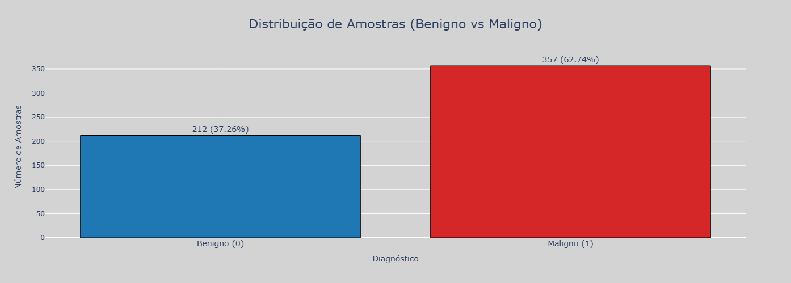
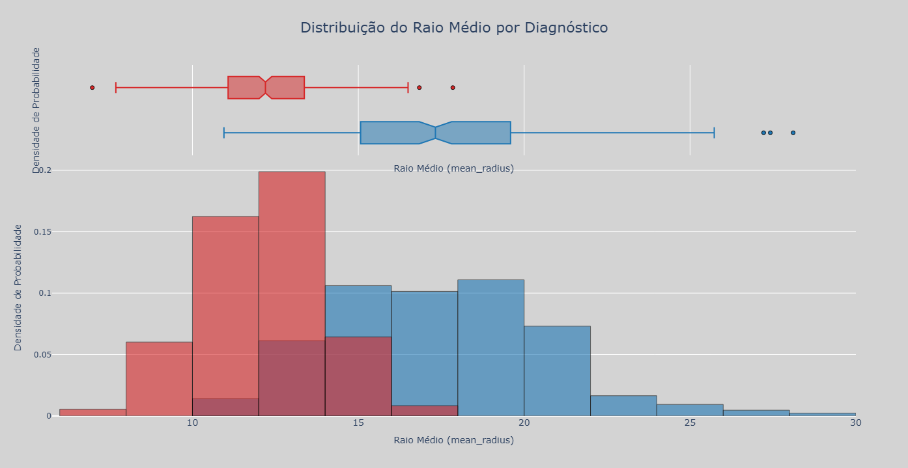
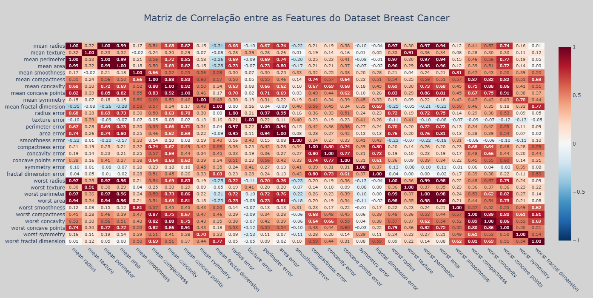
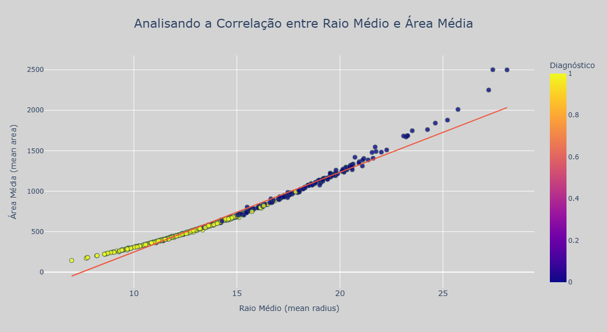

# 🚀 Projeto: Previsão de Malignidade de Tumores usando Modelos de Classificação
O objetivo deste projeto é desenvolver, avaliar e otimizar um modelo de Machine Learning (Classificação Binária) capaz de prever o diagnóstico de tumores (maligno/benigno), demonstrando o pipeline completo de Análise Exploratória, Pré-processamento (Escalonamento) e Seleção de Features, utilizando o dataset Breast Cancer (Wisconsin).

## ✅ Etapas de Inicialização

- Estruturação do projeto em pastas
- Criação do ambiente virtual
- Definição das bibliotecas principais (via `requirements.txt`)
- Configuração do `.gitignore`
- Primeiros arquivos adicionados ao controle de versão

## 📁 Estrutura Inicial de Pastas

```
Proj_BreastCancer_ML/
├── data/
├── analysis/
│   ├── data_processing/       # análises exploratórias
|   ├── data_preprocessing/    # tratamento de Dados para Modelagem
│   ├── reports/               # gráficos e relatórios gerados
├── ML/
│   ├── models/                # arquivos de modelos salvos
│   ├── notebooks/             # experimentos em Jupyter
├── venv/
├── .gitignore
├── LICENSE
├── README.md
└── requirements.txt
```

## 🛠 Tecnologias Utilizadas

Este projeto foi construído utilizando as seguintes ferramentas e bibliotecas:

* **Python 3.x**
* **Pandas:** Para manipulação e processamento de dados.
* **Numpy:** Para suporte a grandes arrays e matrizes multidimensionais, juntamente com uma coleção de funções matemáticas de alto nível para operar nesses arrays. 
* **Jupyter:** Para documentação passo a passo do projeto (EDA e Modelagem).
* **Plotly:** Para a geração de gráficos de alta qualidade e interativos.
* **Scikit-learn:** Para a fase de Modelagem de classificação (Regressão Logística, Random Forest, XGBoost), avaliação de métricas (Acurácia, Precisão, Recall, F1, AUC-ROC).

## ⚙️ Como Instalar e Rodar o Projeto
Para executar a aplicação em sua máquina local, siga os passos abaixo:

1. Clonagem e Configuração do Ambiente
```
# Clone o repositório
git clone [https://github.com/Antoniojrsales/Proj_BreastCancer_ML]
cd Proj_BreastCancer_ML

# Crie e ative o ambiente virtual
python -m venv venv
-nix/Linux: venv/bin/activate  
-Windows: venv\Scripts\activate

## Instale as dependências
pip install -r requirements.txt
```

## 🔎 Análise Exploratória de Dados (EDA)

A etapa de Análise Exploratória foi essencial para validar a integridade do dataset e identificar padrões que guiarão a modelagem.

**1. Estrutura e Qualidade dos Dados**
* **Dimensões:** O dataset contém 569 amostras de pacientes e 31 colunas (30 features + 1 coluna alvo, target).
* **Integridade:** Confirmamos que o dataset é extremamente limpo, não possuindo valores nulos (NaN) ou linhas duplicadas. Não foi necessário aplicar métodos de imputação ou limpeza de dados.

**2. Análise da Variável Alvo e Distribuição**
* **Classes:** A variável alvo, target, é binária, representando os diagnósticos: 0 (Benigno) e 1 (Maligno).
* **Desbalanceamento:** A distribuição de classes é levemente desbalanceada, com 63% de casos Benignos (357 amostras) e 37% de casos Malignos (212 amostras). Essa proporção é gerenciável, mas requer o uso de métricas de avaliação robustas (como F1-Score e ROC-AUC).

**3. Insights Chave para a Modelagem**
A análise descritiva por classe (groupby().describe()) e as visualizações (Boxplots) revelaram as seguintes conclusões de alto impacto:

* **Forte Poder Discriminatório:** As features relacionadas ao tamanho e área do tumor, como mean radius, mean perimeter, e mean area, mostraram as maiores disparidades nas estatísticas (média, mediana) entre as classes maligna e benigna. Isso indica que são os preditores mais importantes do modelo.
* **Correlação:** A visualização do Heatmap de correlação confirmou altas correlações entre features de mesma natureza (ex: mean radius e mean perimeter), uma informação crucial para a etapa de tratamento de multicolinearidade (se necessário).


## 📊 Análise Insights da Análise Visual

Gráfico | Objetivo Analítico | Insights Revelados | [Imagem/Visualização]
| :--- | :--- | :--- | :--- |
| **Gráfico de Barras:** | Avaliar o desbalanceamento das classes. | Confirmou a distribuição levemente desbalanceada: 63% Benigno (357 amostras) vs. 37% Maligno (212 amostras). Esta informação é crucial para a escolha de métricas de avaliação. | |
| **Boxplot & Histograma:** | Visualizar a distribuição da feature mais discriminatória (mean radius). | Separabilidade Forte: O Histograma (com densidade de probabilidade sobreposta) e o Boxplot mostram que a distribuição de tumores Malignos (target=1) está concentrada em valores de mean radius significativamente maiores e com pouca sobreposição com a distribuição dos tumores Benignos. | |
| **Heatmap de Correlação** | Identificar a multicolinearidade e o relacionamento entre todas as 30 features. | Revelou altíssima correlação ($\approx +0.99$) entre features de mesma natureza (Ex: mean radius, mean perimeter e mean area). Isso indica redundância de informação, que deverá ser tratada com a Seleção de Features para estabilizar modelos lineares. | |
| **Gráfico de Dispersão (Scatter Plot):** | Provar visualmente a correlação entre as features e a separabilidade das classes. | Confirma a correlação forte entre mean radius e mean area (reta de tendência clara) e demonstra que os tumores Malignos formam um aglomerado distinto na parte superior direita do gráfico. | |

## ⚙️ Pré-processamento e Estabilização dos Dados

A etapa de pré-processamento foi focada na estabilização das features e na preparação do dataset para o consumo por modelos de Machine Learning (ML), como a Regressão Logística.

**1. Seleção de Features (Tratamento de Multicolinearidade)**
 Com base no Heatmap de Correlação, identificamos o problema de multicolinearidade (correlação $r \approx 0.99$ entre features de mesmo significado, como mean radius e mean perimeter).
  * **Ação:** Removemos **11 features redundantes** para estabilizar o modelo linear. O dataset foi reduzido de **30 para 19 features.**
  * **Status do Dataset:** O DataFrame foi salvo como breast_cancer_cleaned.csv para servir como a fonte de dados limpa para a fase de Modelagem.

**2. Divisão e Escalonamento dos Dados (Preparação Final)**

Na fase de Modelagem, os dados limpos serão carregados e submetidos às seguintes transformações obrigatórias:

* **Divisão (Train/Test Split):** Os dados serão divididos em 80% para Treino e 20% para Teste (usando test_size=0.20), com a aplicação de estratificação para manter a proporção correta de classes Benigno/Maligno em ambos os conjuntos.

* **Escalonamento (StandardScaler):** Será aplicado o StandardScaler para padronizar os dados (média 0 e desvio padrão 1). Esta etapa é vital para que features de diferentes escalas não dominem o treinamento.

* **Regra de Ouro (Data Leakage):** O StandardScaler será treinado (fit) exclusivamente no conjunto de treino e, em seguida, aplicado (transform) aos conjuntos de treino e teste.